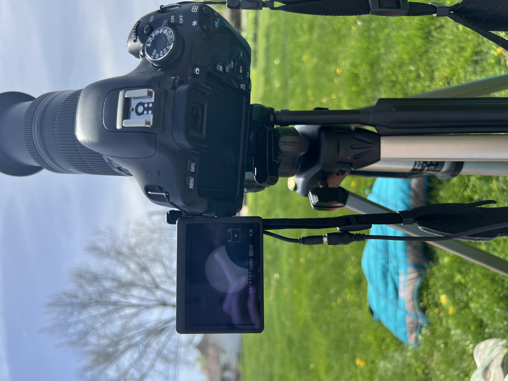
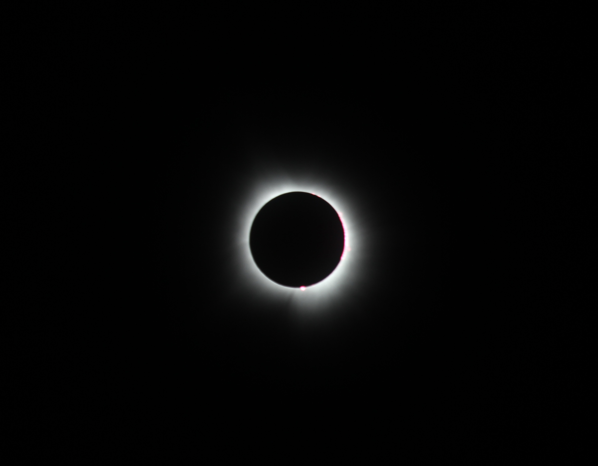
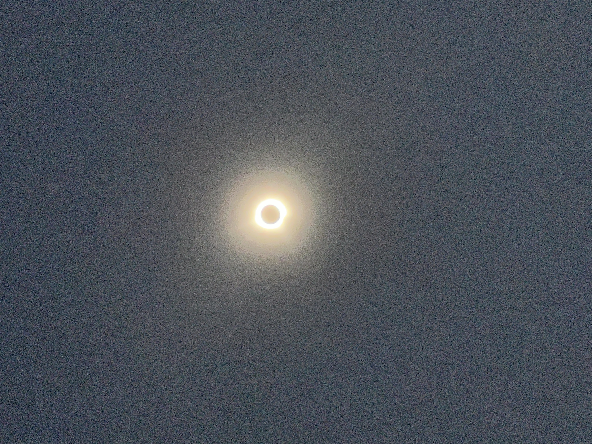
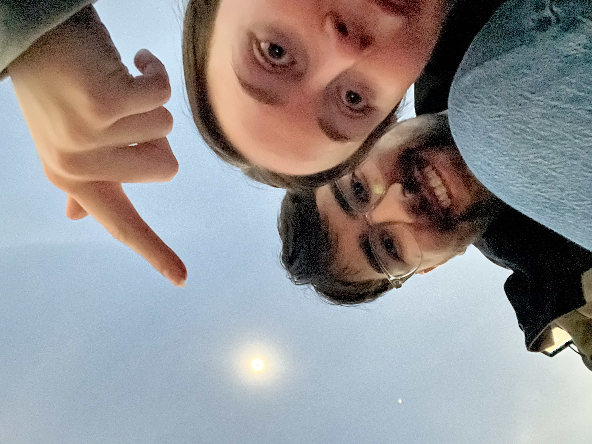

Stayed in Bloomington, IL the night before in a questionable cheap hotel 🤨 but the eclipse was worth it. Ended up in a cute small town called Marshall with lots of grassy space.

I used my Canon EOS T3i with the EF-S 55-250 IS STM and a custom-made solar filter using aluminized mylar for non-eclipsed pictures.

Picture of me next to my camera setup

Tripod set up with preview of partial eclipse (with solar filter). Note the sunspots!

Image of crescent with solar filter

Total eclipse with no filter

Phone picture of total eclipse

Lauren and I taking a selfie with the total eclipse

