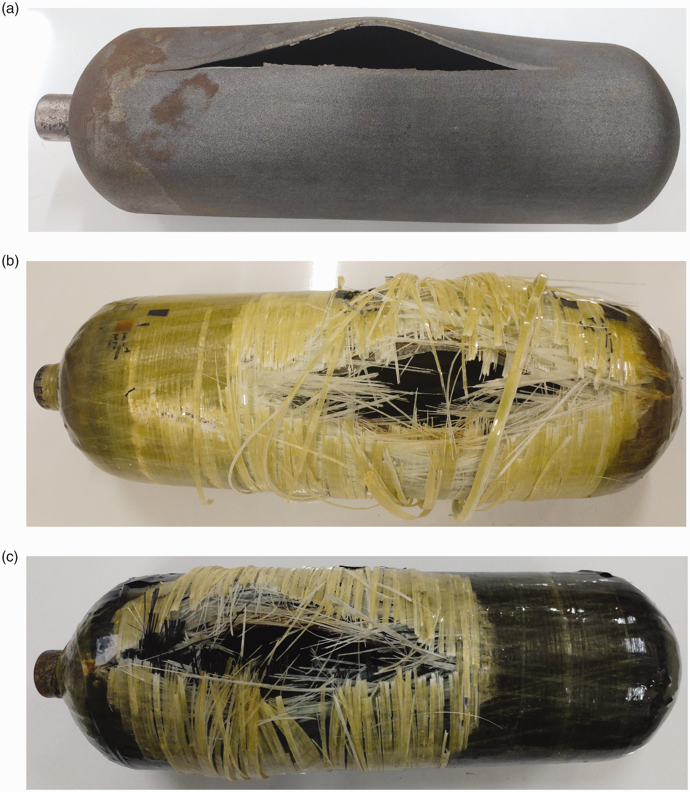
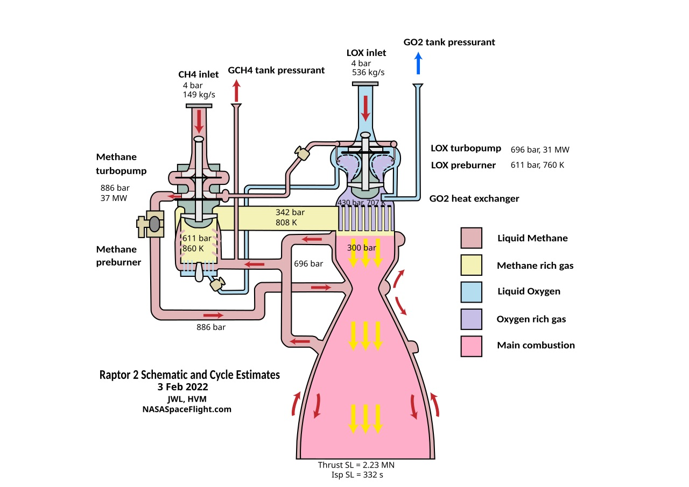

A collection of interview questions I've come across and like to share and discuss with other engineers for fun :)

## Structural

<strong>Given a fixed-free cantilever beam in bending (load at the free end):</strong>

<strong>Where is the highest stress?</strong>

At the base where it is fixed, at both the top and bottom of the cross-section.

<strong>Is the stress tensile or compressive?</strong>

Tensile at the top of the beam and compressive at the bottom.

<strong>How do you know if it will fail completely?</strong>

Ultimate tensile strength since it will be lower than ultimate compressive strength.

<strong>What is the ideal shape of the beam (to prevent failure) and why?</strong>

A cross-section with a high moment of inertia to distribute the stress better such as an I-beam, since the equation for stress due to bending is:
$$
\sigma = \frac{My}{I}
$$

---

<strong>Given a cylindrical pressure vessel with spherical ends: </strong>

<strong>If you are pressure testing it, where do you place the crack (cylinder or end cap) and in what orientation (longitudinally or perpendicularly)?</strong>

Along longitudinal axis so it propagates along hoop stress, that is the hoop stress failure mode.

<strong>If you were to grind that crack out into a divot, how to know if it's still safe to use?</strong>

 Check hand calculations with reduced thickness/stress concentration and see if it is still allowable.

<strong>If your hand calcs say it yields, how to know if we can still use it?</strong>

Can look at local yielding to redistribute stress with hand calcs or FEA.

---

<strong>You’re given a metallic bracket from a rocket, and your boss asks you to figure out if it’s going to break. What questions are you asking?</strong>

- What material is it made from (to get properties)?  
- What loads is it under?  
- What are the specifics of the geometry?

<strong>Your boss tells you it’s made of 15-5 stainless and gives you the loads. What do you do next to find out if it breaks?</strong>

- Start with basic hand calculations like bending and stress analysis  
- Possibly build an FEA model, but verify the FEA with hand calcs

---

<strong>What kind of failure would you expect in an axially loaded slender beam?</strong>

Buckling

<strong>What are the important factors in tendency to buckle?</strong>

Consider Euler buckling and critical load:
$$
P_{\text{cr}} = \frac{\pi^2 E I}{(K L)^2}
$$
- Boundary conditions (affects K value, fixed-fixed will be a lot stronger (lower K) than pinned-free)
- Length of beam (similarly slenderness ratio, ratio of length to radius)
- Stiffness of beam

---

<strong>How do longitudinal and hoop stresses differ, and which one fails first?</strong>

- Hoop stress acts circumferentially and is typically twice as large as longitudinal stress in thin-walled pressure vessels.  
- Longitudinal stress acts along the length of the vessel.  
- Hoop stress usually causes failure first due to its higher magnitude.

## General Solids/Fluids Behavior

<strong>How do you go between stress and strain in a material?</strong>

Hooke's Law in elastic region of material,
$$
\sigma = E \varepsilon
$$
where \(E\) is the Young's modulus or modulus of elasticity.

---

 
<strong>Explain what Reynolds number is and what it tells you.</strong>
 Reynolds number is a dimensionless value that helps predict whether a flow is likely to be laminar or turbulent. It’s not an absolute threshold, but a strong indicator of flow regime tendency. 

---

<strong>How do cryogenic fluids affect metals?</strong>

- Yield strength and ultimate strength both generally increase for stainless steels at cryogenic temperatures.  
- For other metals (heavy generalization) strength may increase but ductility decreases, making metals behave more brittle.  
- Some metals exhibit a brittle transition temperature below which brittleness dominates  
- Thermal contraction and expansion cause dimensional changes and stresses.  
- Thermal conductivity of metals can change at cryogenic temperatures (e.g., copper shows increased conductivity).  

---

<strong>What is the volume ratio for vaporizing fluids, and why is it important?</strong>

- Typically between 800 and 1900.  
- Helps illustrate the immense change in volume when a fluid changes phase and the potential energy contained (such as in a [BLEVE event](https://en.wikipedia.org/wiki/Boiling_liquid_expanding_vapor_explosion))

## Fluid Systems

<strong>You have an orifice in an incompressible fluid system. What happens to the pressure drop when you double the mass flow rate? What about for compressible? Why are they different?</strong>

4x, ~2x, density

---

<strong>What considerations go into developing a LOX fluid system?</strong>

- No trapped fluid: burst disks, relief valves, ball valves with holes, etc  
- Material selection: lots of stainless, PTFE instead of rubber (LOX-compatible)  
- Temperature effects: freezing control devices

---

<strong>What are the main differences between a pneumatic system versus a hydraulic or electromechanical system?</strong>

- Hydraulic systems provide higher force output due to incompressible fluid.  
- Hydraulics are more precise because the fluid is incompressible.  
- Hydraulic systems have shorter time constants (faster response).  
- Pneumatics use compressible air, typically less precise and lower force.  
- Electromechanical systems rely on motors and actuators, often simpler but with different force/response characteristics.

---

<strong>What are the main differences between a conventional valve and a cryogenic valve?</strong>

- Different sealing materials designed to withstand cryogenic temperatures  
- Cryogenic-compatible materials like stainless (often oxygen compatible too)
- Features such as hole in the ball valve to prevent trapped cryogenic fluid

## Propulsion

<strong>If you double the mass flow rate in an engine, how does chamber pressure change? How does thrust change?</strong>

Chamber pressure doubles (PUT EQN)
Thrust doubles (put eqn)

---

<strong>What's the difference between low cycle and high cycle fatigue? What are some examples of both in a rocket engine?</strong>

---

<strong>What is the primary factor that drives tank pressure on a pressure fed rocket engine?</strong>

Pump cavitation - suction pressure

---

 
<strong>Given isentropic flow through a CD nozzle:</strong>
 
 
<strong>How does static pressure change through the nozzle?</strong>
 Decreases in the converging section and decreases further in the diverging section. 
 
 
<strong>What happens if the exit pressure is too high or too low?</strong>
 Overexpanded: exit pressure is too low compared to ambient → potential for flow separation. Underexpanded: exit pressure is too high → less efficient expansion. 
 
 
<strong>How does stagnation pressure change through the nozzle?</strong>
 It stays constant in ideal isentropic flow. 
 
 
<strong>How does Mach number change through the nozzle?</strong>
 Starts low, reaches Mach 1 at the throat, and increases to high supersonic values (e.g., Mach 5 or 6) in the diverging section. 
 
 
<strong>How does temperature change through the nozzle?</strong>
 Temperature decreases in the converging section and drops significantly in the diverging section. 
 

---

<strong>Explain the thermodynamic cycle of a full-flow staged combustion engine like Raptor.</strong>

Explain what goes where and why.

<strong>Do you tap off the fuel and oxidizer for preburners before or after the main pumps?
</strong>

After!

---

<strong>What are the key advantages of using a full-flow staged combustion cycle over other cycles like gas-generator or expander?</strong>

- Less waste heat because all propellant flows through turbines and combustors.  
- More efficient combustion in the main combustion chamber. 

---

<strong>How do you calculate the specific impulse (Isp) of a rocket engine? What factors influence it?</strong>

- Specific impulse is calculated as thrust divided by propellant weight flow rate:  
  $$
  I_{sp} = \frac{F}{\dot{m} g_0}
  $$
- Factors influencing Isp include chamber pressure, nozzle expansion ratio, propellant type, and combustion efficiency.

---

<strong>What happens if you shorten the combustion chamber?</strong>

- Shortening the CC can reduce combustion efficiency and completeness.  
- It may lead to increased combustion instability or incomplete burning.  
- Both of these can reduce overall engine performance and specific impulse.

---

<strong>Compare a single shaft and dual shaft closed cycle engine.</strong>

**Single shaft:**  
- Simple design, lower cost and weight  
- Might not have enough power to drive both pumps  
- Coupled power control between fuel and oxidizer pumps  
- More complex leak considerations due to shared shaft

**Dual shaft:**  
- Independent power control of fuel and oxidizer pumps  
- Can deliver more power overall  
- Heavier and more expensive design  
- Requires more seals and complexity

## Design and Manufacturing

<strong>What’s the difference between MMC and LMC in GD&T?</strong>

- MMC (Maximum Material Condition): part contains the most material (smallest hole, largest pin)
- LMC (Least Material Condition):part contains the least material (largest hole, smallest pin) They affect how much geometric tolerance is allowed based on feature size.
-

---

 

<strong>What are basic dimensions used for in GD&T?</strong>
 Basic dimensions define the exact theoretical location, size, or orientation of a feature. They are used in conjunction with geometric tolerances but are not themselves toleranced.

## Behavioral

<strong>What was a time where you couldn't meet a deadline, and how did you communicate that and deal with it?</strong>

(subjective)

---

<strong>What is an example of a professional failure that you've had, and what did you take away from it?</strong>

My example was a COTS component that failed on our Spaceport 2024 rocket, and from that I learned not to trust a component that I don't fully understand the mechanism of; I didn't realize the eye bolt was only partially threaded, etc.

---

<strong>What's a technical decision that you regret?</strong>

(subjective)

---

 
<strong>What is an important piece of engineering feedback you’ve received?</strong>
 e.g. club industry advisor raised concerns about N₂O system risk. He encouraged stepping back because we didn’t fully understand the fluid behavior and potential hazards. That feedback reinforced the importance of not rushing into implementation without a full systems-level understanding. 

## Random

<strong>How much paint does it take to paint a Falcon 9? (whatever units, give your best guess)</strong>

Having just seen a falcon 9 in person helps. My guess for approximate dimensions were 10ft diameter and 100ft tall. Thus approximately 30ft circumference times 100ft length is 3000ft^2. From painting walls I guessed it takes (very roughly) around 1 gallon to paint a 10ft x 10ft wall (so 100ft^2), so 3000/100 = 30 gallons of paint. Actual answer is around 40 gallons!

