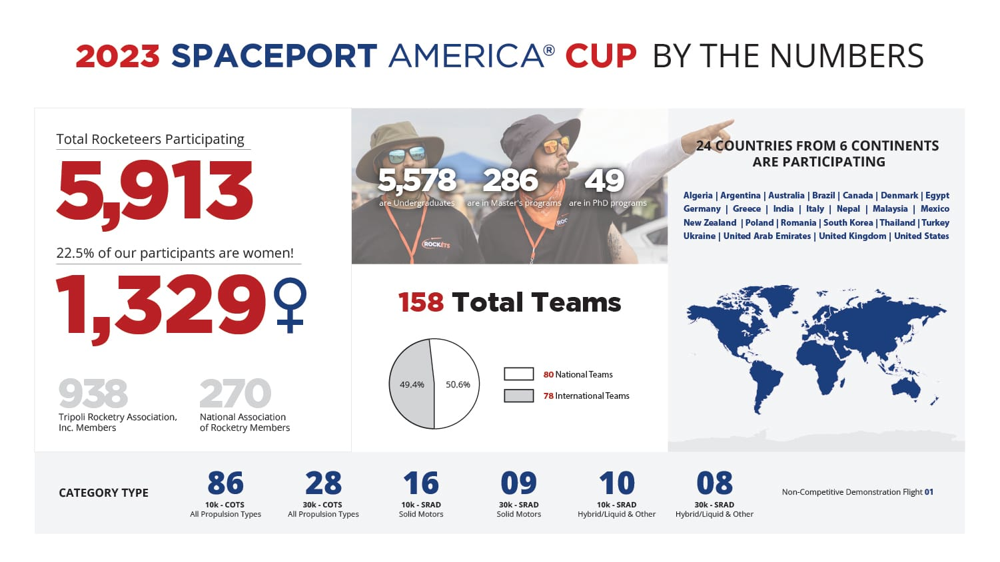

I participated in this rocket competition as President of the UW-Madison's Chapter of AIAA (American Institute for Aeronautics and Astronautics).

Read the UW-Madison College of Engineering's post here:

(https://engineering.wisc.edu/blog/students-compete-at-spaceport-america-cup/)
UW Madison College of Engineering Posts About Spaceport America Cup

## The Competition

The [Spaceport America Cup](https://spaceportamericacup.com) (also known as IREC) is the world's largest intercollegiate rocket competition, with over 150 teams competing annually. There are a number of categories and it takes place outside of Las Cruces in southern New Mexico.

## AIAA UW-Madison

UW Madison's aerospace org has participated in a number of rocket competitions before including Argonia Cup (Argonia, KS) and MRL (Midwest Rocket Launch). Previous teams have applied, but 2023 was the first year we were accepted into the competition.

## The Process

We designed the rocket ourselves specifically for this competition, and it was constructed with mostly COTS components (fiberglass tubes, motor casing, hardware, etc.) and a few Student Researched And Developed (SRAD) parts, such as custom waterjet-cut fiberglass fins with fiberglass/epoxy layup, and custom CNC-routed plywood bulkheads.

(CONSTRUCTION PHOTOS)

As Team Lead for this project and President of the student org at the time, I was in charge of most of the design and construction of the rocket, and oversaw all subsystems such as avionics and payload. This also included intitial development of a radio telemetry system, the code for which can be found on the github repository below.
[

GitHub - aiaauwmadison/spaceport-avionics: live telemetry system utilizing LoRa and APRS to report GPS and flight data to ground

live telemetry system utilizing LoRa and APRS to report GPS and flight data to ground - aiaauwmadison/spaceport-avionics

GitHubaiaauwmadison

](https://github.com/aiaauwmadison/spaceport-avionics)
### Test Flight

In May, we completed construction of the rocket and performed a test launch at a local launch site in IL. In place of our in-development payload, we used jars of peanut butter as ballast (my high school team found out that large peanut butter jars fit perfectly in 4" fiberglass tubing, later that year we also found out what burnt peanut butter and fiberglass smell like after a motor CATO - would not recommend!). The test flight went great and we were set for finishing touches like a fancy paintjob and finalizing development of payload/avionics.

(IMAGE OF PEANUT BUTTER JAR)

## UW College of Engineering Support

This competition would not have been possible without the support from UW Departments of Engineering Physics and Mechanical Engineering. We extend our thanks to all of the donors whose funds go towards helping student orgs like ours.
